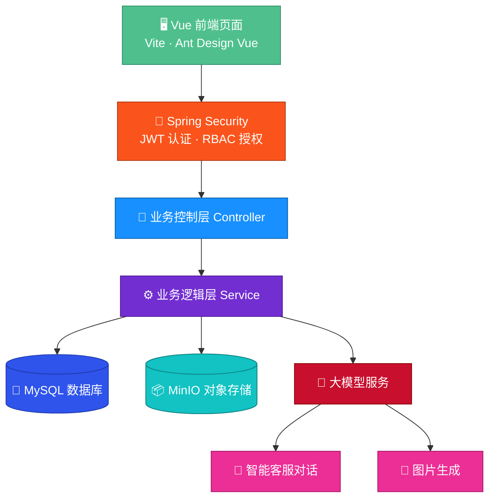
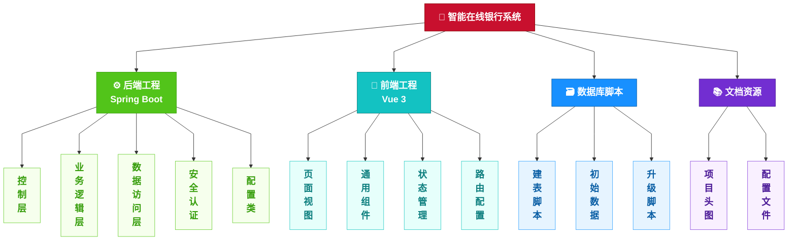

<div align="center">

<br/>


<br/>
<br/>

# 🏦 智能在线银行

### 🤖 AI 驱动 · 前后端分离 · 全流程银行业务实践

<br/>

<table>
<tr>
<td></td>
<td></td>
<td></td>
<td></td>
<td></td>
</tr>
</table>

</div>

---

## 一、🔴 项目简介

> 📌 **一句话定位**：基于 **Spring Boot 3 + Vue 3 + 大模型** 的智能在线银行系统，实现银行业务全流程数字化与 AI 智能客服落地。

本项目为前后端分离工程，通过 Spring AI 接入大模型，提供智能客服、账户管理、转账交易、账单查询、贷款管理等功能。系统共包含 **39 个 REST 接口、16 个前端页面**，由 4 人小组协作完成，本人担任项目组长，负责架构设计、AI 客服开发与测试工作。

<div align="center">

| 🏗️ 后端类 | 🌐 接口数 | 🖥️ 页面数 | 👥 团队 |
|:---:|:---:|:---:|:---:|
| 70+ | 39 | 16 | 4 人 |

</div>

> ⚠️ 本项目所有数据均为模拟数据，不涉及真实金融业务。

---

## 二、🟠 技术栈
&nbsp;&nbsp;&nbsp;&nbsp;&nbsp;&nbsp;&nbsp;系统后端采用 Java 17 语言，基于 Spring Boot 3.2.5 框架开发，使用 Spring Security 6 实现安全认证与权限控制；AI 能力基于 Spring AI 1.0.0-M4 框架接入大模型；数据层采用 MyBatis-Plus 3.5.6 操作 MySQL 8.0 数据库，并通过 MinIO 8.5.10 实现文件对象存储。前端采用 Vue 3.4 框架，配合 Ant Design Vue 4.2 组件库与 Pinia 2.1 状态管理，基于 Vite 5.4 构建，使用 ECharts 5.5 完成数据可视化。此外，项目采用 Knife4j 4.4.0 生成接口文档，后端基于 Maven 3.8+ 构建，测试使用 JUnit 5 框架。

---

## 三、🟡 系统架构



> 系统采用标准分层架构：前端 JWT 认证 → 控制层 → 逻辑层 → 数据层；AI 能力独立封装，与业务模块解耦。

---

## 四、🟢 功能模块
<div align="center">

| 序号 | 功能模块 | 主要功能 |
|:---:|---|---|
| 1 | 用户管理 | 用户注册、登录认证、个人信息维护 |
| 2 | 账户管理 | 账户查询、充值、账户流水、余额管理 |
| 3 | 转账交易 | 行内转账、限额校验、交易记录查询 |
| 4 | 账单管理 | 月度账单自动生成、收支明细查询 |
| 5 | 贷款管理 | 贷款申请、审批、分期还款 |
| 6 | 支票管理 | 支票开具、兑付、作废（管理员） |
| 7 | AI 智能客服 | 多会话管理、流式对话、上下文记忆、图片生成 |
| 8 | 管理后台 | 数据统计、用户管理、账户管理、贷款审批 |

</div>

---

## 五、🔵 项目结构



---

## 六、🟣 项目成果

1. ✅ 完成 **8 大功能模块**，实现银行业务全流程闭环，共交付 39 个接口、16 个页面；
2. ✅ AI 客服支持**流式输出与多轮上下文记忆**，通过系统提示词约束、敏感词过滤、防诈骗提醒保障输出安全；
3. ✅ 设计**大模型故障兜底机制**，服务异常时自动切换本地回复，保证系统稳定可用；
4. ✅ 转账功能通过**数据库事务与限额校验**，保障资金数据一致性；
5. ✅ 项目通过功能、接口及性能测试，**课程设计获评优秀**。

---

## 七、⚫ 快速启动

**① 初始化数据库**

依次执行 `sql` 目录下的 `init.sql`脚本。

**② 修改配置**

在 `application.yml` 中配置数据库连接与大模型 API Key（建议通过环境变量传入，勿明文提交密钥）。

**③ 启动后端**

```bash
mvn spring-boot:run
```

**④ 启动前端**

```bash
cd frontend
npm install
npm run dev
```

<div align="center">

| 访问入口 | 地址 |
|---|---|
| 🖥️ 前端页面 | http://localhost:3000 |
| 📖 接口文档 | http://localhost:8080/doc.html |
| ❤️ 健康检查 | http://localhost:8080/actuator/health |

</div>

---

## 八、免责声明

本项目仅用于学习交流与技术研究，系统中涉及的机构名称、业务数据均为模拟数据，与真实机构无关。

<div align="center">

<sub>🚀 By BUAS</sub>

</div>
