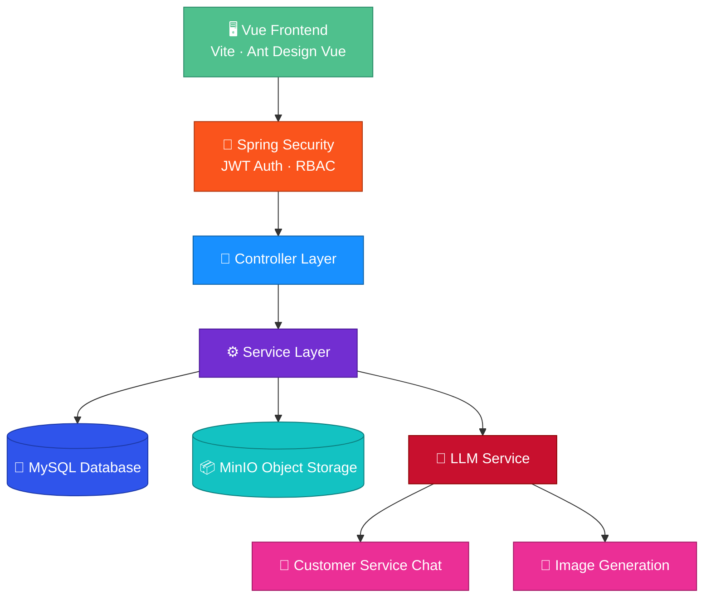
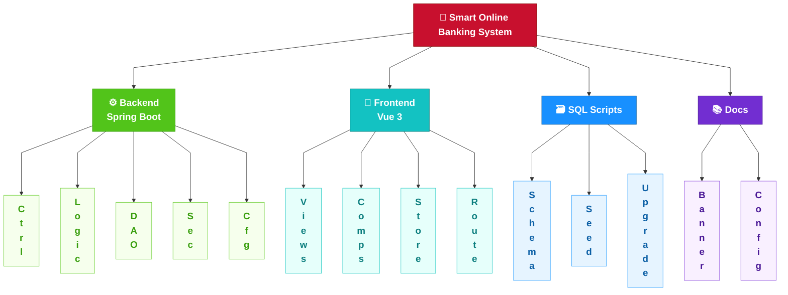

<div align="right">
</div>

<div align="center">
<br/>

<br/>
<br/>
# 🏦 Smart Online Banking
### 🤖 AI-Powered · Frontend & Backend Separated · Full-Process Banking Practice
<br/>
<table>
<tr>
<td></td>
<td></td>
<td></td>
<td></td>
<td></td>
</tr>
</table>
</div>

---

## 1. 🔴 Project Overview
> 📌 **In one sentence**: A smart online banking system built on **Spring Boot 3 + Vue 3 + LLM**, enabling the digitalization of full-process banking services and an AI customer service.

This is a frontend-backend separated project that integrates a large language model through Spring AI, providing intelligent customer service, account management, fund transfer, bill inquiry, and loan management. The system contains **39 REST APIs and 16 frontend pages**, completed collaboratively by a 4-person team. I served as the team leader, responsible for architecture design, AI customer service development, and testing.

<div align="center">

| 🏗️ Backend Classes | 🌐 APIs | 🖥️ Pages | 👥 Team |
|:---:|:---:|:---:|:---:|
| 70+ | 39 | 16 | 4 |

</div>

> ⚠️ All data in this project is simulated and does not involve any real financial business.

---

## 2. 🟠 Tech Stack
The backend is developed in Java 17 on the Spring Boot 3.2.5 framework, using Spring Security 6 for authentication and access control. AI capabilities are powered by the Spring AI 1.0.0-M4 framework to integrate the large language model. The data layer uses MyBatis-Plus 3.5.6 to operate the MySQL 8.0 database and MinIO 8.5.10 for object storage. The frontend is built with Vue 3.4, the Ant Design Vue 4.2 component library, and Pinia 2.1 for state management, bundled with Vite 5.4, with ECharts 5.5 for data visualization. In addition, Knife4j 4.4.0 is used to generate API documentation, the backend is built with Maven 3.8+, and JUnit 5 is used for testing.

---

## 3. 🟡 System Architecture

> The system follows a standard layered architecture: frontend JWT authentication → Controller layer → Service layer → Data layer. AI capabilities are encapsulated as independent services and decoupled from business modules.

---

## 4. 🟢 Functional Modules
<div align="center">

| No. | Module | Main Functions |
|:---:|---|---|
| 1 | User Management | Registration, login authentication, profile maintenance |
| 2 | Account Management | Account inquiry, recharge, account flows, balance management |
| 3 | Fund Transfer | Internal transfer, limit validation, transaction history |
| 4 | Bill Management | Automatic monthly bills, income and expenditure details |
| 5 | Loan Management | Loan application, approval, installment repayment |
| 6 | Check Management | Check issuance, cashing, voiding (admin) |
| 7 | AI Customer Service | Multi-session management, streaming chat, context memory, image generation |
| 8 | Admin Console | Data statistics, user/account management, loan approval |

</div>

---

## 5. 🔵 Project Structure


---

## 6. 🟣 Project Outcomes
1. ✅ Delivered **8 major functional modules**, closing the full loop of banking services, with 39 APIs and 16 pages;
2. ✅ The AI customer service supports **streaming output and multi-turn context memory**, with output safety ensured through system prompt constraints, sensitive-word filtering, and anti-fraud reminders;
3. ✅ Designed an **LLM fallback mechanism** that automatically switches to local replies when the model service is unavailable, keeping the system stable;
4. ✅ Fund transfer ensures data consistency through **database transactions and limit validation**;
5. ✅ The project passed functional, interface, and performance tests, and the **course design was rated Excellent**.

---

## 7. ⚫ Quick Start
**① Initialize the database**

Run the `init.sql` script in the `sql` directory.

**② Configure the application**

Set up the database connection and LLM API key in `application.yml` (environment variables are recommended; do not commit keys in plain text).

**③ Start the backend**
```bash
mvn spring-boot:run
```
**④ Start the frontend**
```bash
cd frontend
npm install
npm run dev
```
<div align="center">

| Entry | URL |
|---|---|
| 🖥️ Frontend | http://localhost:3000 |
| 📖 API Docs | http://localhost:8080/doc.html |
| ❤️ Health Check | http://localhost:8080/actuator/health |

</div>

---

## 8. Disclaimer
This project is intended solely for learning, exchange, and technical research. The institution names and business data involved are all simulated and are unrelated to any real organization.

<div align="center">
<sub>🚀 By BUAS</sub>
</div>
